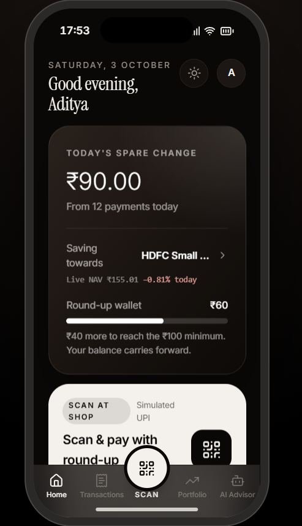
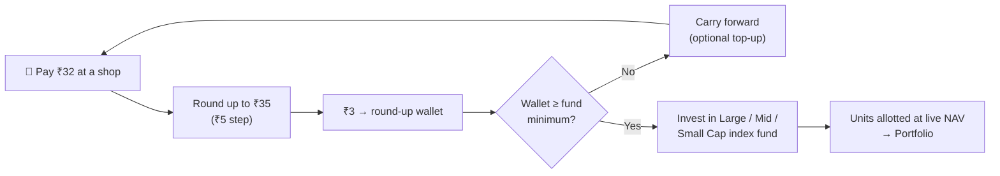
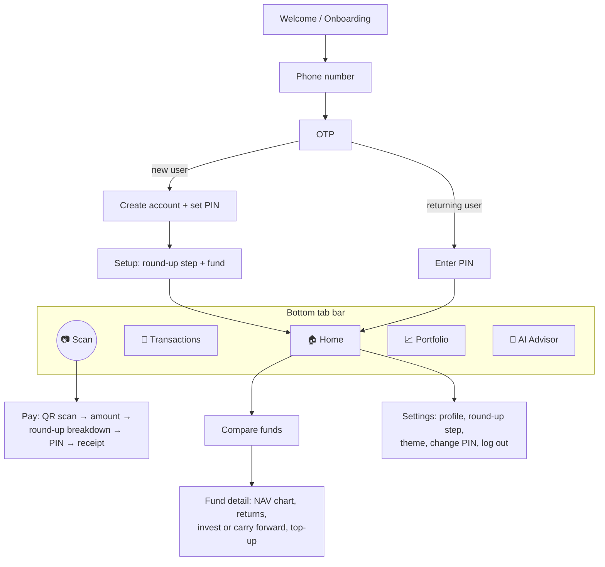
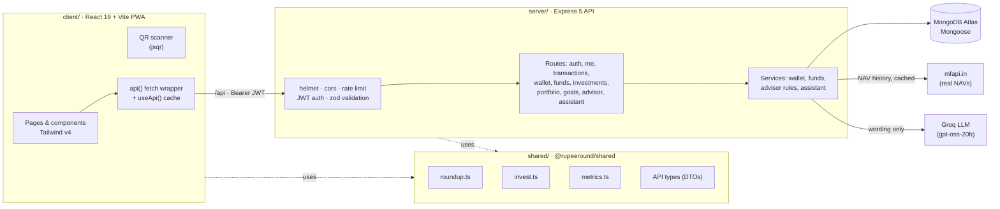
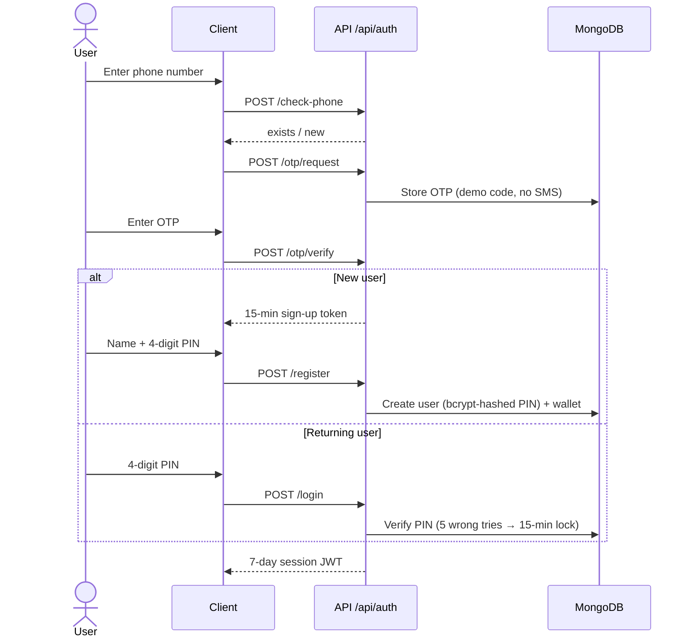
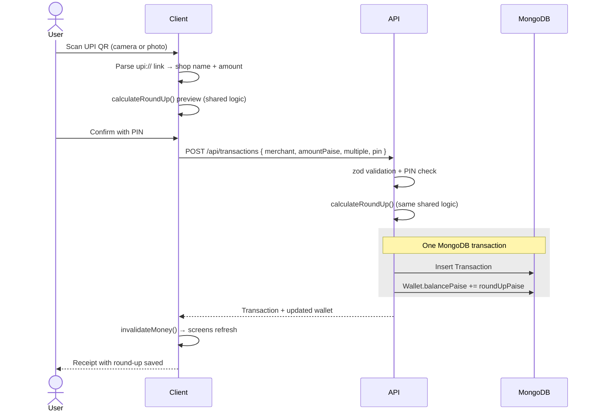
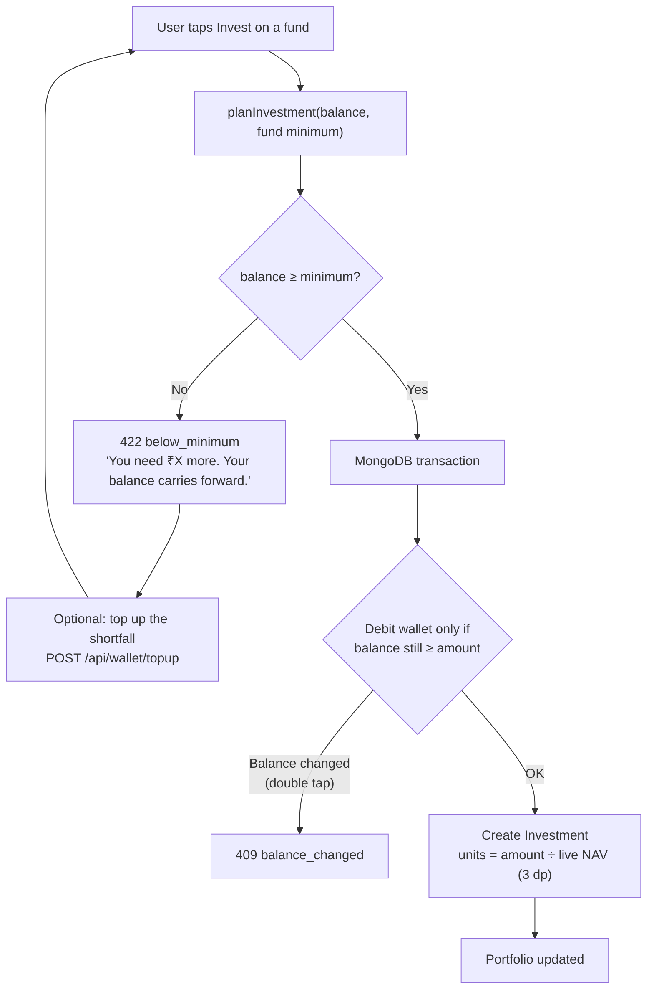
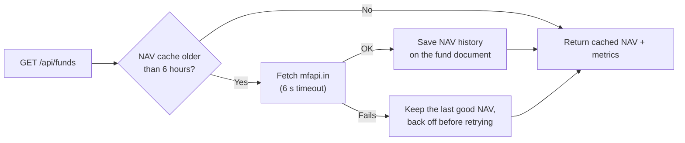
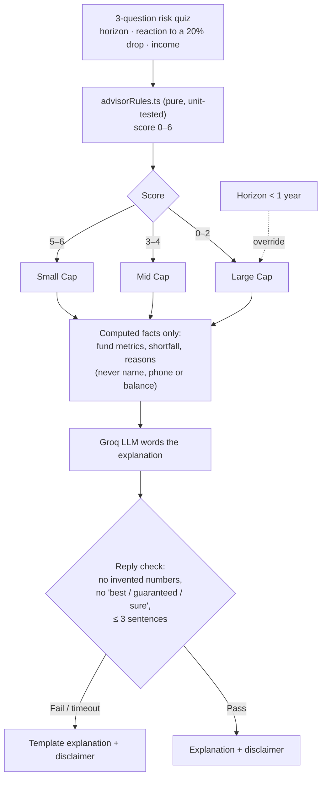
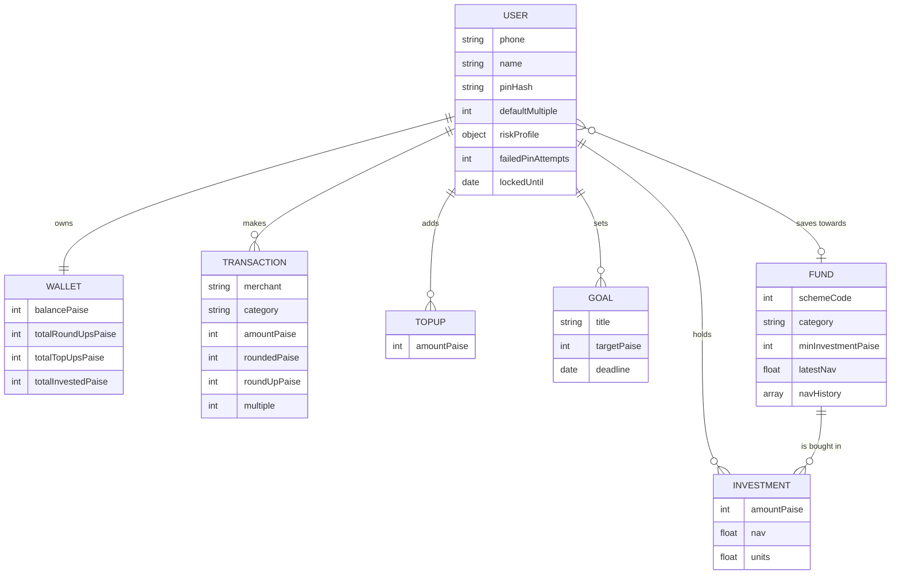

<div align="center">

# RupeeRound

**Pay. Round up. Build your investment habit.**

A mobile-first micro-investing app that turns the spare change from everyday UPI payments into mutual fund investments.




</div>

> **Hackathon prototype.** Payments and investments are **simulated**. No real money moves. Fund NAVs are **real** (live from [mfapi.in](https://www.mfapi.in)); fund minimums are demo values and are labelled as such in the app.

---

## Contents

- [The idea](#the-idea)
- [Features](#features)
- [How it works](#how-it-works)
- [UI walkthrough](#ui-walkthrough)
- [Architecture](#architecture)
- [Workflow diagrams](#workflow-diagrams)
- [AI advisor: rules decide, AI explains](#ai-advisor-rules-decide-ai-explains)
- [Data model](#data-model)
- [Engineering highlights](#engineering-highlights)
- [Tech stack](#tech-stack)
- [API reference](#api-reference)
- [Project structure](#project-structure)
- [Run it locally](#run-it-locally)
- [Demo script](#demo-script-2-minutes)
- [Testing](#testing)
- [Deployment](#deployment)

---

## The idea

Most students and young earners in India want to start investing but never feel they have "enough" to begin. Meanwhile they make dozens of small UPI payments every week.

**RupeeRound connects the two.** Every payment is rounded up to a step you choose, and the difference is saved automatically:

| You pay at a shop | Round-up step | Charged | Saved to wallet |
|---|---|---|---|
| ₹32 | ₹5 | ₹35 | **₹3** |
| ₹147 | ₹10 | ₹150 | **₹3** |
| ₹88.50 | ₹20 | ₹100 | **₹11.50** |
| ₹40 | ₹10 | ₹40 | ₹0 (already a multiple) |

Once the round-up wallet covers a fund's minimum, you invest it in a **Large, Mid or Small Cap index fund**. Below the minimum, the balance **carries forward** to next time, with an optional top-up to get there sooner.

---

## Features

| | Feature | What it does |
|---|---|---|
| 📷 | **Scan & pay** | Scan any real UPI QR code (live camera, or a photo fallback). The shop name and amount fill in, and the round-up breakdown appears before you pay. |
| 🪙 | **Round-up wallet** | Choose a ₹5 / ₹10 / ₹20 / ₹50 / ₹100 step. Spare change collects in a wallet, with progress shown towards the chosen fund's minimum. |
| ↪️ | **Carry-forward rule** | You can only invest once the wallet covers the fund minimum. Until then the balance carries forward, and you can top up the difference. |
| 📈 | **Real fund data** | Three real index funds with live NAVs from mfapi.in, plus 1M / 3M / 1Y / 3Y returns, volatility and drawdown computed from NAV history. |
| 💼 | **Portfolio** | Units held, invested amount, current value and gain/loss at today's NAV. |
| 🧭 | **Fund suggestion** | A three-question risk quiz scores you 0–6 and maps you to Large, Mid or Small Cap. The decision comes from fixed, unit-tested rules, and AI only words the explanation. |
| 🤖 | **Ask RupeeRound AI** | A chat assistant that only answers mutual-fund questions. It can look up **any** Indian mutual fund on mfapi.in through tool calls, and refuses off-topic questions. |
| 🔐 | **Phone + OTP + PIN auth** | Sign-up by phone number and OTP, then a 4-digit PIN to log in and to confirm every payment. Five wrong PINs lock the account for 15 minutes. |
| 🌗 | **Dark and light themes** | Premium monochrome design, dark by default, with a light toggle. |
| 📱 | **Installable PWA** | Full-screen on phones, shown in a phone frame on desktop, with offline-capable assets through a service worker. |

---

## How it works



The two core rules are small, pure functions shared by the client and the server, so the preview a user sees always matches what the API books:

- [`shared/src/roundup.ts`](shared/src/roundup.ts): `calculateRoundUp(amountPaise, multipleRupees)`
- [`shared/src/invest.ts`](shared/src/invest.ts): `planInvestment(balancePaise, minimumPaise)` returns either `eligible` or `carry-forward` with the shortfall

---

## UI walkthrough

The app is designed for a 6.5-inch phone (414×896) in a premium monochrome palette: near-black and very dark brown surfaces with warm white text, Inter for UI and numbers, and Instrument Serif for headings.

| Home |
|:---:|
|  |
| Today's spare change, the fund you're saving towards with its live NAV, and wallet progress towards the minimum. |

### Screen map



| Screen | Route | Highlights |
|---|---|---|
| Home | `/` | Today's spare change, selected fund with live NAV, wallet progress, scan shortcut |
| Transactions | `/transactions` | Every payment with its round-up, grouped by day |
| Scan & pay | `/pay?scan=1` | UPI QR scanner (`jsqr`), demo shop QR, round-up breakdown, PIN confirm, receipt |
| Portfolio | `/portfolio` | Holdings, invested vs current value, gain/loss |
| Compare funds | `/funds` | Large / Mid / Small Cap side by side, rule-based suggestion card |
| Fund detail | `/funds/:id` | NAV history chart (Recharts), returns, invest / carry-forward / top-up |
| AI Advisor | `/advisor` | "Ask RupeeRound AI" chat |
| Settings | `/settings` | Profile, round-up step, theme, PIN |

---

## Architecture

A **pnpm monorepo** with three TypeScript packages. The `shared` package holds the money logic and the API types, so the client and server can't drift apart.



---

## Workflow diagrams

### 1. Sign-up and login



### 2. Scan, pay and round up



### 3. Invest or carry forward



### 4. Live fund data



---

## AI advisor: rules decide, AI explains

Financial suggestions shouldn't depend on a model's mood, so the AI never decides anything.



**Ask RupeeRound AI** (`POST /api/assistant/chat`) follows the same principles:

- Mutual-fund topics only. Anything else, including prompt-injection attempts, gets one fixed refusal line.
- It can call two tools: `search_funds` and `get_fund_data`. These look up **any** Indian mutual fund on mfapi.in, with returns and volatility computed in code, not by the model.
- It never predicts returns and never tells the user to buy or sell.
- If Groq is down, the API still returns HTTP 200 with `source: 'unavailable'`, so the UI degrades gracefully.
- The Groq API key lives only on the server. Every explanation ends with *"Educational only, not financial advice. Past performance does not decide future returns."*

---

## Data model



**Funds used** (real schemes, live NAVs):

| Category | Fund | mfapi.in code | Demo minimum |
|---|---|---|---|
| Large Cap | UTI Nifty 50 Index Fund – Direct Growth | 120716 | ₹100 |
| Mid Cap | Motilal Oswal Nifty Midcap 150 Index Fund – Direct Growth | 147622 | ₹500 |
| Small Cap | HDFC Small Cap Fund – Direct Growth | 130503 | ₹100 |

---

## Engineering highlights

- **Integer paise everywhere.** All money is stored and computed as integer paise (`amountPaise`, `balancePaise`), with no floating-point rupees. It is converted to ₹ only for display.
- **Atomic wallet updates.** Every money movement (payment, top-up, investment) runs inside a **MongoDB transaction** together with the record it creates, so the wallet and the history can never disagree.
- **Double-tap safe investing.** The wallet debit is conditional (`balancePaise >= amount`), so two quick taps can't overspend the wallet.
- **One source of truth.** The round-up, carry-forward and fund-metric logic lives in `shared/` and runs on both client and server.
- **Security basics done properly.** PINs are hashed with bcrypt, sessions use JWTs, a PIN is needed for every payment and five wrong PINs trigger a lockout. On top of that: helmet, a CORS allow-list, a 20 KB body limit, rate limits on auth and AI routes, and zod validation of every request body.
- **Guard-railed AI.** Deterministic rules make the decision and the LLM only writes the wording. Replies are checked against forbidden words and invented numbers, and a template answer is used when a check fails. Explanations are cached for 3 hours and no personal data is sent to the model.
- **Resilient external data.** mfapi.in NAVs are cached for 6 hours, requests time out after 6 seconds, and the last good NAV is used if the service is down.
- **Real UPI QR parsing.** Works with real shop QR codes (`upi://pay?pa=…&pn=…&am=…`) through the live camera, or by photo upload where camera access isn't available.
- **Mobile-native feel on the web.** A PWA with safe-area handling, skeleton loading states, subtle reveal animations that respect reduced motion, and a phone frame on desktop.
- **Type-safe end to end.** Strict TypeScript in every package, with shared DTO types for every API response.

---

## Tech stack

| Layer | Technology |
|---|---|
| **Frontend** | React 19, React Router v7, Vite 8, Tailwind CSS v4, Recharts v3, lucide-react, jsqr, PWA (manifest + service worker) |
| **Backend** | Node.js 22, Express 5, Mongoose 9, zod 4, bcryptjs, jsonwebtoken, helmet, cors, express-rate-limit |
| **Database** | MongoDB Atlas (multi-document transactions) |
| **AI** | Groq (`openai/gpt-oss-20b`) with tool calling |
| **Data** | mfapi.in (real Indian mutual fund NAV history) |
| **Tooling** | pnpm workspaces, TypeScript strict, tsx, Node's built-in test runner, mise |
| **Hosting** | Vercel (client), Render (API), MongoDB Atlas (DB) |

---

## API reference

All routes are under `/api`. Everything except `/auth` and `/health` needs `Authorization: Bearer <JWT>`. Errors share one format: `{ "error": { "code", "message", "details" } }`.

| Method | Route | Purpose |
|---|---|---|
| `GET` | `/health` | Liveness check |
| `POST` | `/auth/check-phone` | Is this number already registered? |
| `POST` | `/auth/otp/request` | Send an OTP (demo code in the prototype) |
| `POST` | `/auth/otp/verify` | Verify the OTP → sign-up token or login step |
| `POST` | `/auth/register` | Create an account with name and PIN |
| `POST` | `/auth/login` | Phone + PIN → session JWT |
| `GET` / `PATCH` | `/me` | Profile, round-up step, selected fund |
| `PATCH` | `/me/risk-profile` | Save risk quiz answers |
| `POST` | `/me/pin` | Change PIN |
| `GET` / `POST` | `/transactions` | List payments / make a simulated payment with round-up |
| `GET` | `/wallet` | Balance, totals and progress towards the fund minimum |
| `POST` | `/wallet/topup` | Simulated top-up |
| `GET` | `/funds` | Funds with live NAV and computed metrics |
| `GET` | `/funds/:id/nav-history` | NAV history for charts |
| `GET` / `POST` | `/investments` | List investments / invest from the wallet |
| `GET` | `/portfolio` | Holdings valued at the latest NAV |
| `GET` / `POST` / `PATCH` / `DELETE` | `/goals` | Savings goals |
| `GET` | `/advisor` | Rule-based fund suggestion with an AI-worded explanation |
| `POST` | `/assistant/chat` | "Ask RupeeRound AI" mutual-fund chat |

---

## Project structure

```
RupeeRound/
├── client/                     React + Vite PWA
│   ├── public/                 manifest, service worker, icons
│   └── src/
│       ├── pages/              one file per screen (+ auth/ flow)
│       ├── components/         PhoneFrame, TabBar, QrScanner, sheets, skeletons…
│       ├── layouts/            AppLayout with the bottom tab bar
│       ├── context/            auth session, theme, toasts
│       └── lib/                api(), useApi(), UPI QR parsing
├── server/                     Express 5 REST API
│   └── src/
│       ├── routes/             one router per resource, zod-validated
│       ├── services/           wallet, funds (mfapi.in), advisorRules, advisor, assistant, groq
│       ├── models/             User, Wallet, Transaction, TopUp, Investment, Fund, Goal, Otp
│       ├── middleware/         JWT auth, error handler
│       └── scripts/seed.ts     demo account reset
├── shared/                     @rupeeround/shared
│   └── src/                    roundup.ts, invest.ts, metrics.ts, money.ts, types.ts (+ tests)
└── docs/screenshots/           README images
```

---

## Run it locally

**Requirements:** Node.js 22+, pnpm 10 (`npm i -g pnpm@10`), and a MongoDB connection string (Atlas free tier works; transactions need a replica set, which Atlas provides).

```bash
git clone https://github.com/adityanarayan404/RupeeRound.git
cd RupeeRound
pnpm install
cp server/.env.example server/.env   # fill in MONGODB_URI and JWT_SECRET (GROQ_API_KEY optional)
pnpm seed                            # creates the demo account
pnpm dev                             # API on :4000, app on http://localhost:8443
```

Open **http://localhost:8443**. On a laptop the app appears in a phone frame. To try it on your phone, open `http://<your-laptop-ip>:8443` on the same Wi-Fi. The live camera scanner needs HTTPS or localhost; the photo fallback works everywhere.

### Demo credentials

| | |
|---|---|
| Phone | **98765 43210** |
| PIN | **1234** |
| OTP (any new account) | **123456** |

New accounts work with any 10-digit number starting with 6–9.

### Environment variables (`server/.env`)

| Variable | Required | Description |
|---|---|---|
| `MONGODB_URI` | ✅ | MongoDB connection string |
| `JWT_SECRET` | ✅ | Long random string for signing JWTs |
| `PORT` | | API port (default `4000`) |
| `CLIENT_ORIGIN` | | Comma-separated frontend URLs allowed by CORS |
| `DEMO_OTP` | | OTP accepted for every number (default `123456`) |
| `NAV_CACHE_HOURS` | | How long fetched NAVs are reused (default `6`) |
| `GROQ_API_KEY` | | Enables AI explanations and the chat; without it the template answers are used |
| `GROQ_MODEL` | | Defaults to `openai/gpt-oss-20b` |

### Scripts

| Command | What it does |
|---|---|
| `pnpm dev` | Runs the API and Vite together (Vite proxies `/api`) |
| `pnpm seed` | Resets the demo account |
| `pnpm test` | Unit tests for shared money/metrics logic and the advisor rules |
| `pnpm typecheck` | TypeScript across all packages |
| `pnpm build` | Production build of the client |
| `pnpm start` | Starts the API in production |

---

## Demo script (2 minutes)

1. **Log in** with 98765 43210 and PIN 1234. Home shows ₹72 in the wallet, just short of the ₹100 minimum for HDFC Small Cap.
2. **Tap Scan** → *Use a demo shop QR* (or scan any real UPI QR). The shop and amount fill in and the round-up breakdown appears. Pay with PIN 1234 and see the receipt.
3. **Home → Compare funds.** Live NAVs and 1M/3M/1Y/3Y returns. Open a fund: if the balance is below the minimum it carries forward. **Add money**, then **Invest**.
4. **Portfolio.** See the new units at today's NAV.
5. **AI Advisor.** Ask *"How long until I can invest?"*, *"Is small cap risky?"* or *"Tell me about Parag Parikh Flexi Cap"*. Then try an off-topic question to see the guardrail.

Run `pnpm seed` again to reset.

---

## Testing

```bash
pnpm test        # Node's built-in test runner via tsx
pnpm typecheck   # strict TypeScript, all packages
```

Unit tests cover the parts where mistakes would cost money or trust:

- **`shared/`**: paise formatting and parsing, round-up edge cases, fund metrics (returns, volatility, drawdown)
- **`server/`**: risk scoring table and the short-horizon override in `advisorRules`, and the assistant's reply filtering and refusal logic in `assistantText`

---

## Deployment

| Part | Platform | Settings |
|---|---|---|
| Database | MongoDB Atlas | Network Access: allow `0.0.0.0/0` (or Render's IPs) |
| API | Render (Web Service) | Root: repo root · Build: `pnpm install --frozen-lockfile` · Start: `pnpm start` · Env: `MONGODB_URI`, `JWT_SECRET`, `CLIENT_ORIGIN=https://<app>.vercel.app`, optional `GROQ_API_KEY`, `GROQ_MODEL` |
| Client | Vercel | Root: `client` · Build: `pnpm build` · Output: `dist` · Env: `VITE_API_URL=https://<api>.onrender.com` |

---

## Disclaimer

RupeeRound is a **hackathon prototype** built for learning and demonstration. No real payments or investments happen. Fund minimums are demo values. Nothing in the app is financial advice, and past performance does not decide future returns.

---

<div align="center">

Built by **Aditya Narayan** and team for an 8-hour college hackathon.

</div>
